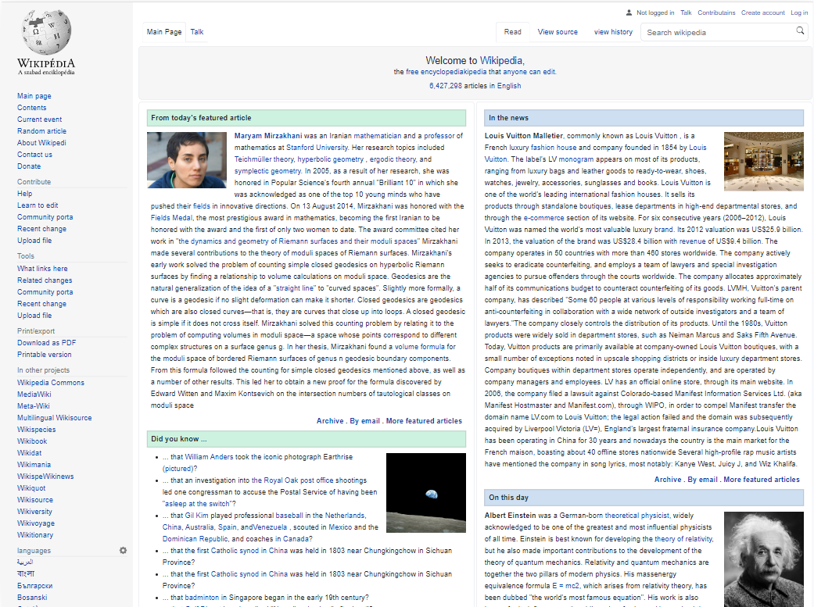
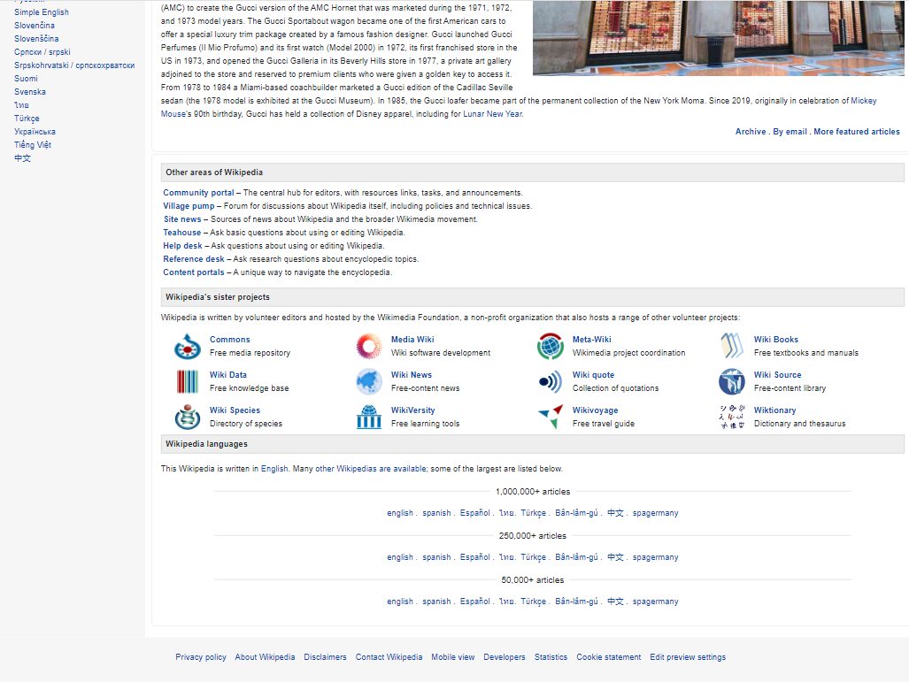
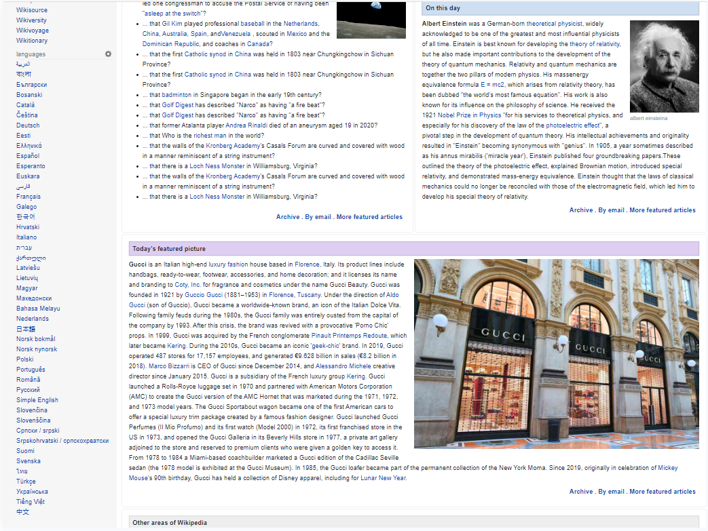
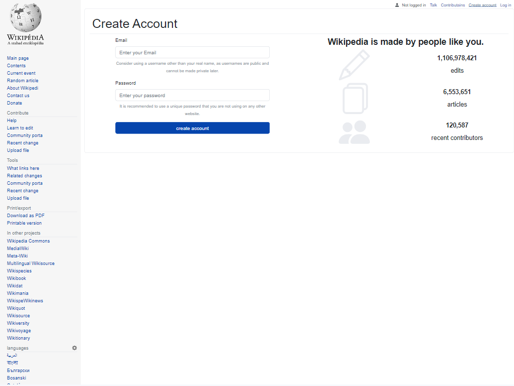
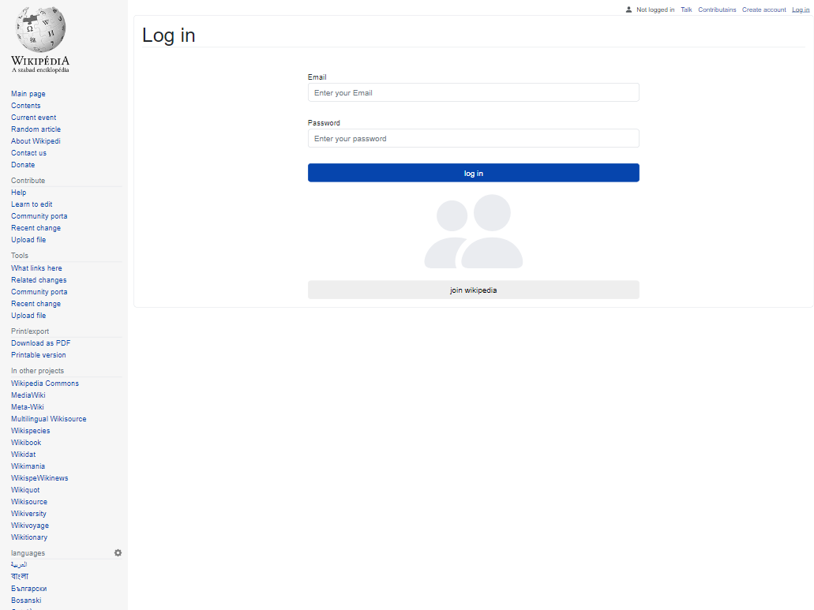
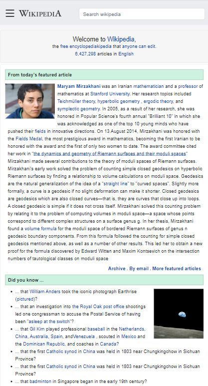
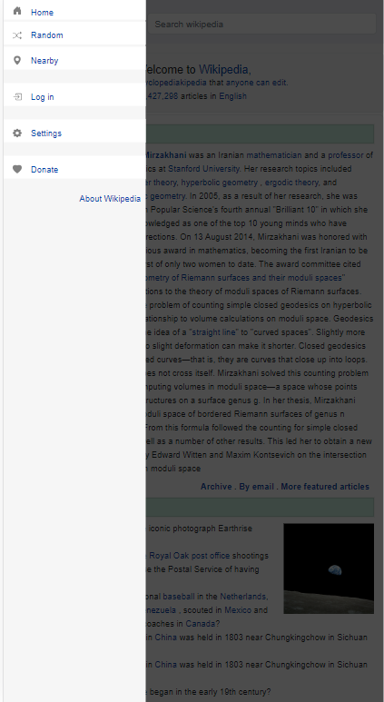

# wikipedia

I created this project with cra
This project is a simulation of the famous wikipedia website
This project is fully responsive

<!-- Live demo [myWikipedia](https://instagram-clone.iran.liara.run)-->
Live demo [myWikipedia](https://wikipedia-pi.vercel.app/wikipedia)
> Live demo [myWikipedia](https://marziyemonshizadeh.github.io/wikipedia/)
## Technologies Used

   

 

## Features

You can :
- log in
- log out
- sign up

## Screenshots

<!-- If you have screenshots you'd like to share, include them here. -->

## Project Status

Project is: \_Completed

## Contact

Created by Marzieh Monshizadeh :)
